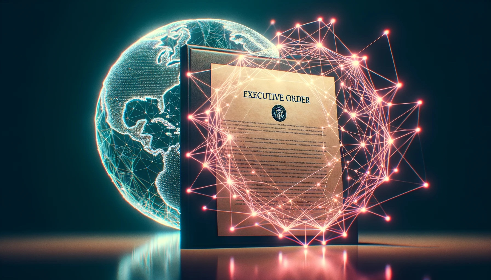

# Language Models on the AI Executive Order



On October 30th, 2023, President Biden signed the [Executive Order on the Safe, Secure, and Trustworthy Development and Use of Artificial Intelligence](https://www.whitehouse.gov/briefing-room/presidential-actions/2023/10/30/executive-order-on-the-safe-secure-and-trustworthy-development-and-use-of-artificial-intelligence/). The order itself is quite sweeping and touches many government departments and agencies, with a focus on harnessing AI's potential and defending against harms and risks.

In this Notebook, we'll deploy language models to rapidly discover information from the Order. For the easiest setup, I recommend trying this out in a Google Colab notebook.

<a target="_blank" href="https://colab.research.google.com/github/hodgesmr/llm_ai_eo/blob/main/llm_ai_eo.ipynb">
  
</a>

Many of the strategies presented here are extensions from Simon Willison's work in his blog post, [Embedding paragraphs from my blog with E5-large-v2](https://til.simonwillison.net/llms/embed-paragraphs). Simon also maintains a handly command line utility for working with various LLM models, aptly named [LLM](https://llm.datasette.io/en/stable/). While Simon's writing largely focuses on the CLI capabilities of the tool (and the usefully opinionated integrations with SQLite), I prefer working with Pandas Dataframes. Here I show how to use the LLM library in that fashion.

### Example

```
Query:
what does it say about AI with regards to copyright?

Response:
The policy states that within 270 days of the date of the order, the Under Secretary of Commerce for Intellectual Property and Director of the United States Patent and Trademark Office (USPTO Director) shall consult with the Director of the United States Copyright Office and issue recommendations to the President on potential executive actions relating to copyright and AI. The recommendations shall address any copyright and related issues discussed in the United States Copyright Office's study, including the scope of protection for works produced using AI and the treatment of copyrighted works in AI training.

Specifically, the policy mentions the following with regards to copyright and AI:

* The USPTO Director shall issue guidance to USPTO patent examiners and applicants addressing inventorship and the use of AI, including generative AI, in the inventive process.

* The USPTO Director shall issue additional guidance to USPTO patent examiners and applicants to address other considerations at the intersection of AI and IP, which could include updated guidance on patent eligibility to address innovation in AI and critical and emerging technologies.

* The USPTO Director shall consult with the Director of the United States Copyright Office and issue recommendations to the President on potential executive actions relating to copyright and AI.
```

## License

All code is provided under the [BSD 3-Clause license](https://github.com/hodgesmr/llm_ai_eo/blob/main/LICENSE).

## A Matt Hodges project

This project is maintained by [@MattHodges](https://mastodon.social/@MattHodges).

_Please use it for good, not evil._
